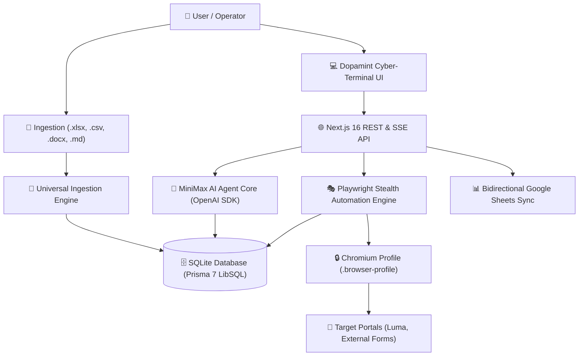

# ⚡ Dopamint AutoBot (`dopamint_autobot`)

<p align="center">
  <strong>Enterprise Agent-as-a-Service (AaaS) Platform for Intelligent Event Registration & Form Automation</strong>
</p>

<p align="center">
  
  
  
  
  
  
  
</p>

---

## 🌟 Overview

**Dopamint AutoBot** is a production-grade Agent-as-a-Service (AaaS) platform engineered to automate multi-attendee registrations across complex web forms (such as Luma, Eventbrite, and custom portals) at scale.

Powered by **MiniMax** (`MiniMax-Text-01`) reasoning and a battle-tested **Playwright Stealth Engine**, Dopamint AutoBot replaces error-prone manual form submissions with a cyber-styled terminal interface, natural language coordination, drag-and-drop document ingestion, and human-in-the-loop (HITL) checkpoints.

---

## 🏗️ Core Architecture



---

## ✨ Key Features

- 🧠 **MiniMax AI Reasoning Core**:
  - Native OpenAI SDK compatibility targeting MiniMax endpoint (`https://api.minimax.io/v1`).
  - Intelligent context grounding with live attendee profiles, company data, and event parameters.
  - Seamless offline mock fallback when API keys are unconfigured.

- 📁 **Universal Multi-Format Ingestion**:
  - Drag-and-drop ingestion of spreadsheets (`.xlsx`, `.xls`), delimited tables (`.csv`, `.tsv`), Word documents (`.docx`), and Markdown (`.md`, `.txt`).
  - Automated field extraction for attendees, company roles, social handles, wallets, and event links.

- 🎭 **Playwright Stealth Automation Engine**:
  - Persistent Chromium session profile (`.browser-profile`) preserving authenticated cookies.
  - Randomized anti-bot pacing (18–26s delays, 350ms human keystrokes).
  - Scheduled 2.0-minute cooldown pauses every 10 registrations to eliminate rate limits.
  - Smart field synthesis resolving names, roles, websites, handles, referral sources, and custom answers.
  - Reliable checkbox consent waivers with DOM change event dispatching.
  - Cloudflare Turnstile security challenge detection and Human-in-the-Loop (HITL) pause handling.

- 🖥️ **Dopamint Cyber-Terminal UI/UX**:
  - Left Panel: Conversational AI chat with multi-format file upload zone.
  - Right Panel: Real-time Attendee × Event matrix, interactive status pills, metric cards, and live terminal log stream.

- 📊 **Bidirectional Google Sheets Sync**:
  - Automated TSV generation for `Submitted Events` (with verified answers).
  - Structured categorization for `Non-Submitted Events` (Category A: Custom inputs, Category B: Ecosystem defaults, Category C: Sold out / Waitlist).
  - One-click synchronization trigger directly from the UI or via chat.

---

## 🚀 Quick Start

### 1. Prerequisites
- **Node.js**: v20+ or v22+
- **Package Manager**: `npm` or `bun`

### 2. Installation
```bash
# Clone the repository
git clone https://github.com/your-username/dopamint_autobot.git
cd dopamint_autobot

# Install dependencies
npm install
```

### 3. Environment Setup
Copy the sanitized environment template:
```bash
cp .env.example .env
```

Configure your `.env` variables:
```env
DATABASE_URL="file:./dev.db"

# MiniMax AI Model Configuration
MINIMAX_API_KEY="your_minimax_api_key_here"
MINIMAX_BASE_URL="https://api.minimax.io/v1"
MINIMAX_MODEL="MiniMax-Text-01"

# Google Sheets Configuration
GOOGLE_SHEET_URL="https://docs.google.com/spreadsheets/d/your-sheet-id/edit"

# Pacing Configuration
PACING_MIN_DELAY=18
PACING_MAX_DELAY=26
PACING_FIELD_DELAY_MS=350
PACING_BREATHER_INTERVAL=10
PACING_BREATHER_DURATION_SEC=120
```

### 4. Database Setup & Seeding
```bash
# Generate Prisma bindings
npm run db:generate

# Seed the database
npm run db:seed
```

### 5. Run Self-Tests
Verify the entire system passes all automated self-tests:
```bash
npm test
```

### 6. Start the System (Decoupled Architecture)
```bash
# Terminal 1: Start Hono Backend (Port 4000)
npm run backend

# Terminal 2: Start Next.js Cyber-Terminal (Port 3000)
npm run start   # (or npm run dev)
```

- **Next.js Dashboard:** [http://localhost:3000](http://localhost:3000)
- **Hono Backend API:** [http://localhost:4000](http://localhost:4000) (Health check: `/health`)

---

## 🧪 Automated Testing & Verification

Dopamint AutoBot includes a self-test suite ([`scripts/self-test.ts`](scripts/self-test.ts)) covering all system layers:

```bash
npm test
```

```text
=========================================================
🚀 Dopamint AutoBot (AaaS) Full System Self-Test Suite
=========================================================
📦 Suite 1: Database & ORM Integrity (6 Attendees, 148 Events, 685 Regs) [PASS]
📁 Suite 2: Multi-Format Ingestion Engine (.csv, .md, .xlsx)            [PASS]
🧠 Suite 3: MiniMax AI Core & System Prompts (Live LLM Active)           [PASS]
🎭 Suite 4: Playwright Stealth Automation Engine                         [PASS]
🌐 Suite 5: Live Next.js REST API Verification                           [PASS]
=========================================================
📊 Execution Summary: 16/16 Passed (0 Failed) in 885ms
=========================================================
```

---

## 📡 REST API Reference

| Endpoint | Method | Description |
| :--- | :--- | :--- |
| `/api/events` | `GET` | Fetches attendee matrix, event catalog, and completion statistics |
| `/api/chat` | `POST` | Interacts with MiniMax AI agent; routes natural language commands |
| `/api/upload` | `POST` | Ingests `.xlsx`, `.csv`, `.docx`, or `.md` files; imports attendees & events |
| `/api/automation/start` | `POST` | Launches batch registration runner across specified events and attendees |
| `/api/automation/status` | `GET` | Returns live runner state, active job, and recent execution logs |
| `/api/automation/pause` | `POST` | Pauses active automation runner |
| `/api/automation/resume` | `POST` | Resumes paused automation runner |
| `/api/automation/stop` | `POST` | Cancels active automation runner |
| `/api/sheets/sync` | `POST` | Triggers bidirectional Google Sheets synchronization |

---

## 📚 Specification & Planning Documentation

- 📋 [Product Requirements Document (`prd.md`)](prd.md)
- 🎨 [System Architecture & UI/UX Design (`design.md`)](design.md)
- 📐 [Technical Specification & API Contracts (`spec.md`)](spec.md)
- 🗺️ [Implementation Plan (`implementationplan.md`)](implementationplan.md)
- 📝 [Task Checklist (`todo.md`)](todo.md)
- 📜 [Release Changelog (`CHANGELOG.md`)](CHANGELOG.md)

---

## 🔒 Security & Privacy

- **No Hardcoded Secrets**: All API keys, tokens, and sensitive defaults are loaded strictly from `.env`.
- **Session Privacy**: Browser persistent profiles (`.browser-profile`) and local databases (`dev.db`) are excluded from Git version control via `.gitignore`.
- **Sanitized Templates**: A clean template is maintained in `.env.example`.

---

## 📜 License

Distributed under the MIT License. See `LICENSE` for more information.
