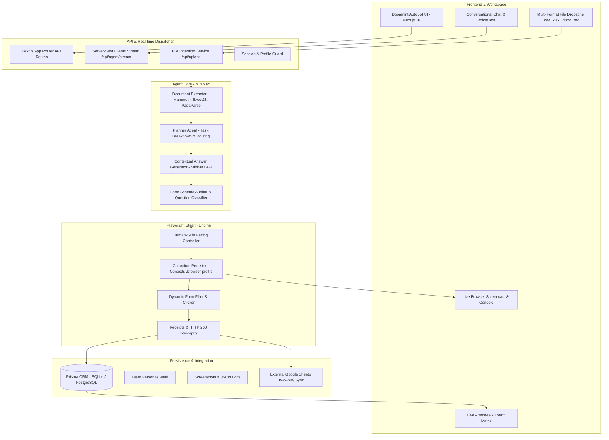
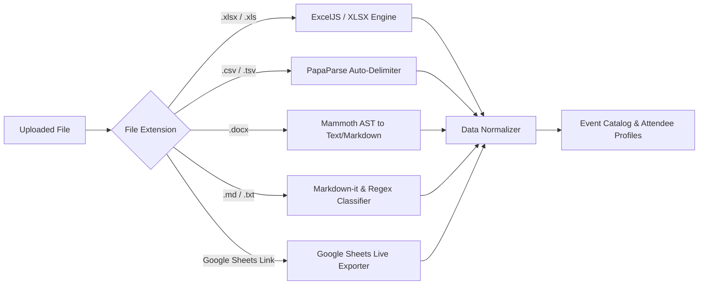
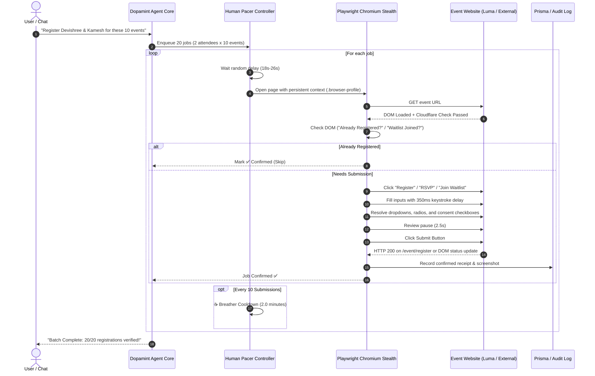

# 🏗️ System & UI/UX Design Document
## Project: `dopamint_autobot` (Directory: `automation_form`)
**Architecture Type:** Agent-as-a-Service (AaaS) Modular Full-Stack Platform  
**Target Stack:** Next.js 16 (App Router) + Tailwind CSS v4 + Prisma + Playwright Stealth + MiniMax LLM  

---

## 1. High-Level System Architecture

`dopamint_autobot` decouples the user-facing conversational experience from the heavy-duty browser automation engine, joined together via a resilient job state machine and real-time streaming pipeline.



---

## 2. Core Subsystems

### 2.1 The Conversational Agent Brain (MiniMax Integration)
- **API Driver:** Standard `openai` Node.js client configured with:
  ```typescript
  import OpenAI from "openai";

  export const minimaxClient = new OpenAI({
    baseURL: process.env.MINIMAX_BASE_URL || "https://api.minimax.io/v1",
    apiKey: process.env.MINIMAX_API_KEY,
  });
  ```
- **Supported Models:**
  - `MiniMax-Text-01`: High-speed, high-context general conversation and extraction.
  - `MiniMax-M3`: Deep reasoning with `reasoning_details` support for edge-case resolution.
  - Pluggable fallback to `gpt-4o`, `gemini-2.0-flash`, or `claude-3-7-sonnet`.
- **Agent Tool Calling (Function Calling):**
  - `parse_file_contents({ fileId, fileType })`: Triggers document extractors.
  - `audit_event_urls({ urls })`: Dispatches crawler to inspect target form structures.
  - `launch_automation_batch({ eventIds, attendeeIds, paceConfig })`: Starts Playwright queue.
  - `request_human_input({ eventId, question, attendeeId })`: Triggers chat prompt for missing data.
  - `sync_to_google_sheet({ spreadsheetUrl })`: Updates external spreadsheet tabs.

---

### 2.2 Universal File Ingestion Pipeline
The ingestion engine extracts clean tabular entities and semantic knowledge from arbitrary user uploads:



- **Docx Extraction:** Extracts executive bios, company background, event lists, or agendas into structured text.
- **Spreadsheet Auto-Mapping:** Detects column names fuzzily (`Date`, `Event Name`, `Title`, `Link`, `URL`, `Ticket`, `Status`) and normalizes rows into standardized `Event` entities.
- **Persona Extraction:** Ingests team spreadsheets and maps columns to `AttendeeProfile` (Name, Role, Email, Phone, TG, Twitter, Wallets).

---

### 2.3 Stealth Browser Execution Engine

The core execution engine implements the battle-tested techniques derived from registering 685+ events with zero bot blocks:



---

## 3. UI/UX Interface Design

### 3.1 Design Language & Palette
- **Brand Theme:** Dopamint Cyber-Terminal (Deep Dark Slate with Neon Indigo & Electric Emerald).
- **Background:** `#090D16` (Deep Space Dark), `#0F172A` (Card Slate).
- **Accents:**
  - Electric Emerald (`#10B981`): Confirmed / Server 200 OK.
  - Neon Cyan (`#06B6D4`): Active / Submitting.
  - Cyber Indigo (`#6366F1`): Primary Interactive / AI Thinking.
  - Amber Gold (`#F59E0B`): Waiting / Action Needed / Breather Pause.
  - Rose Red (`#EF4444`): Closed / Error.
- **Typography:** Inter for clean readability; JetBrains Mono for logs, URLs, and JSON data.

### 3.2 Layout Structure
```
+-----------------------------------------------------------------------------------------------+
|  ⚡ DOPAMINT AUTOBOT | Agent-as-a-Service  [Status: Online]  [Model: MiniMax-M3]  [Team: 6]     |
+-------------------------------------+---------------------------------------------------------+
|  LEFT PANEL (40%): CONVERSATIONAL   |  RIGHT PANEL (60%): AUTOMATION CONTROL DECK             |
|                                     |                                                         |
|  [ Chat History Stream ]            |  [ Stats Overview Cards: 685 Confirmed | 99.3% | Pacing ]|
|  - User: "Here is the KBW sheet"    |  -----------------------------------------------------  |
|  - AutoBot: "Extracted 148 events.  |  [ Tabs: 📊 Matrix | 🖥️ Live Browser | 📜 Console Logs ] |
|    115 auto-ready, 8 waitlists..."  |                                                         |
|                                     |  Event Title      | Devie | Kamesh | Ram | Jawwy | UV ... |
|  [ Human-in-the-Loop Action Card ]  |  #4  Namsan Hike  |  ✅   |   ✅   | ✅  |  ✅   | ✅ ... |
|  "Event #66 asks for token raise:   |  #14 Perp-Dex Day |  ✅   |   ✅   | ✅  |  ✅   | ✅ ... |
|   Target in USD? [ $5M ] [Submit]"  |  #40 Seoul Index  |  ✅   |   ✅   | ✅  |  ✅   | ✅ ... |
|                                     |  #66 Token Sale   |  ⚠️   |   ⚠️   | ⚠️  |  ⚠️   | ⚠️ ... |
|  ---------------------------------  |  -----------------------------------------------------  |
|  [ + Attach .xlsx, .docx, .md, csv] |  [ Active Job: Event #83 -> Submitting for Anup Kumar ]  |
|  [ Type instruction to AutoBot... ] |  [ Pacing: resting 21s 🐢 ] [ ⏸️ Pause ] [ ⏹️ Stop ]    |
+-------------------------------------+---------------------------------------------------------+
```

---

## 4. Security, Stealth & Reliability Architecture

1. **Persistent Browser Session Isolation:**  
   Browser sessions are stored in an encrypted local profile directory (`.browser-profile`), preventing Cloudflare bot heuristics from detecting fresh headless incognito fingerprints.
2. **Encrypted Personas Vault:**  
   Attendee private information (phone numbers, personal emails, wallet private credentials if applicable) is encrypted at rest using AES-256-GCM.
3. **Graceful Degradation:**  
   If an event fails or has closed ticket sales (e.g. Event #23), the scheduler marks the event as `Closed by Host`, skips to the next attendee, and does not halt the overall team pipeline.
4. **Idempotent Resumption:**  
   Every single event registration is indexed by `${eventId}_${attendeeEmail}` in Prisma. Re-running the pipeline immediately skips already-confirmed events without wasting API requests.
